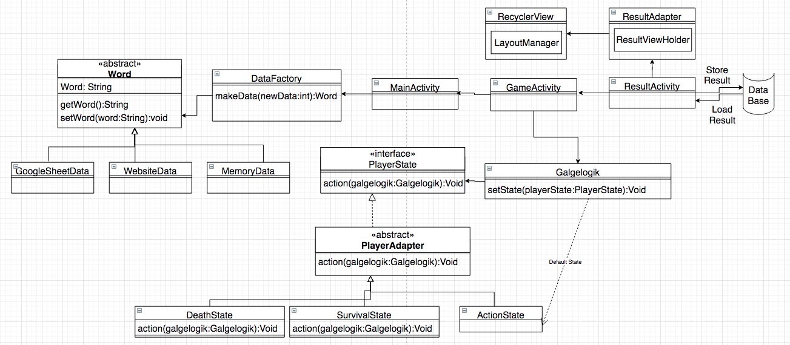

# Galgeleg_android

## Design Pattern that used to build this app 

# Requirement
    1- At least the version should be 24 or lower ----done---- 
    2- At least 5 layouts in XML (Should be Beautiful) ----done----  
    3- User interaction (Back navigation or re-navigation) ----done---- 
    4- Network communication with multithreaded programming are used (DR website or online spreadsheet) ----done----
    5- Data should be stored locally (e.g. PreferenceManager) ----done----
    6- A list to show high score. The list could have score, word and date. (Use class object (Name: Result))
        * not sure about 6 requirement 
    7- Choose the words from a list ----done----  
    8- Motivation for user. Choose 2 from 3: ----done---- 
        1- Play a sound, when user won or lost ----done---- 
        2- Show an animation
        3- Use 3rd party library (e.g. when user won or lost https://android-arsenal.com/details/1/4299, http://airbnb.io/lottie/#/ or https://lottiefiles.com/) ----done----
    9- App's name (values/strings.xml -> <string name="app_name">s123456 Sørens Super Galgeleg</string>) ----done----
    10- APK-file app/build/outputs/apk/debugapp-debug.apk inside the root of ZIP-file
    11- History of version control

# The requirements should be meaningful: 
    1- A user choose word from list then give the phone to his friend to gusse the word
    2- The data that being stored should be used again
    3- The user should know that the word come from DR's webstie and the user can't start until the word have been retrieved. 
      
### Delete .gradle, build and app/build (build inside app-directory) from ZIP-file before I upload
      
